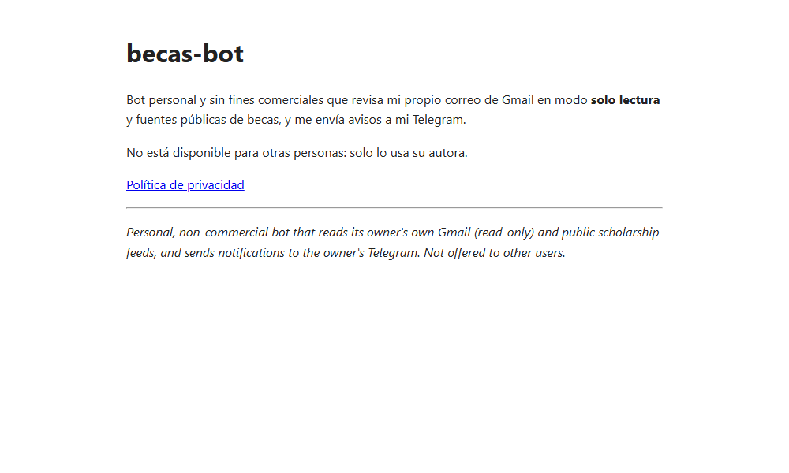

# becas-bot · páginas públicas

Página de inicio y política de privacidad de **becas-bot**, un bot personal y sin fines comerciales que revisa mi propio Gmail en modo solo lectura y fuentes públicas de becas, y me avisa por Telegram.

El código del bot está en un repositorio privado. Este repositorio solo publica las dos páginas que Google pide para verificar la app que usa la API de Gmail.

**Ver la página:** https://niurkavane11.github.io/becas-bot-info/

## Páginas

| Archivo | Enlace | Contenido |
|---|---|---|
| `index.html` | [Inicio](https://niurkavane11.github.io/becas-bot-info/) | Qué hace el bot y quién lo usa |
| `privacy.html` | [Privacidad](https://niurkavane11.github.io/becas-bot-info/privacy.html) | Qué datos lee, qué guarda y cómo revocar el acceso |

## Resumen de privacidad

- Solo accede al Gmail de su autora, con el permiso `gmail.readonly`. No envía, borra ni modifica correos.
- Solo guarda los identificadores de los mensajes ya avisados, no el contenido.
- No comparte datos con terceros ni los usa para publicidad o para entrenar modelos de IA.

## Publicación

Se sirve con GitHub Pages desde la rama principal. Son HTML estático, sin dependencias.
